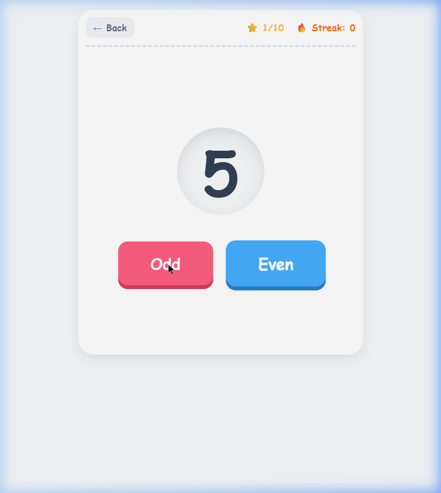
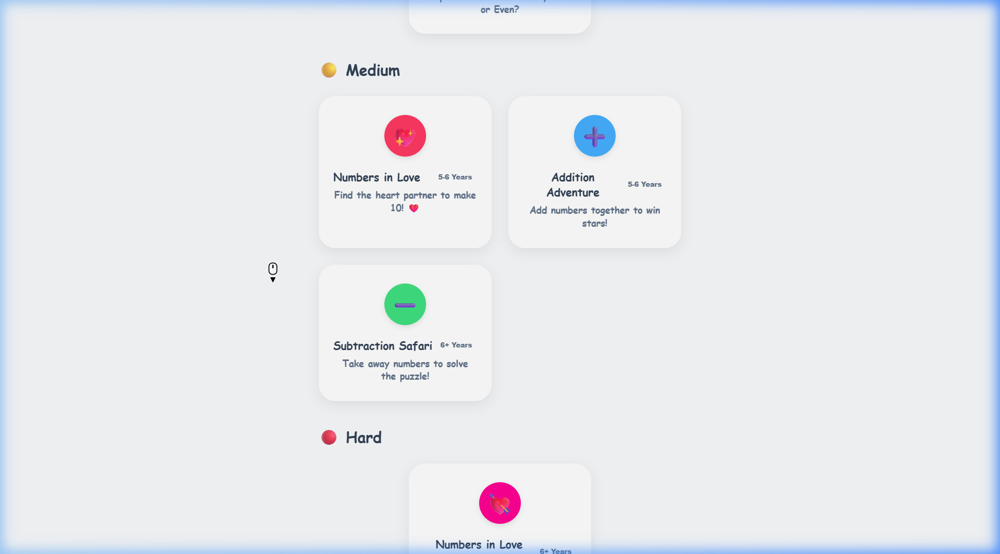
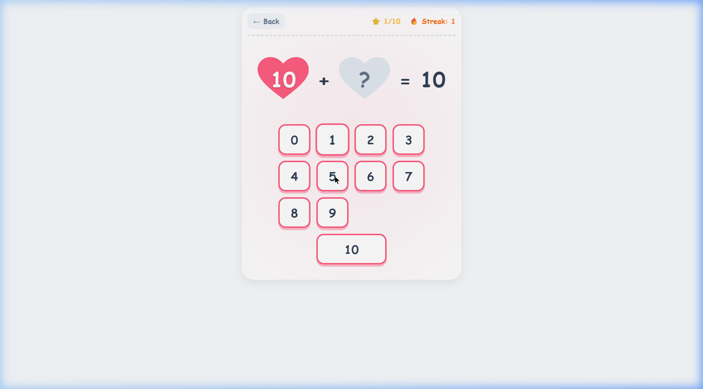
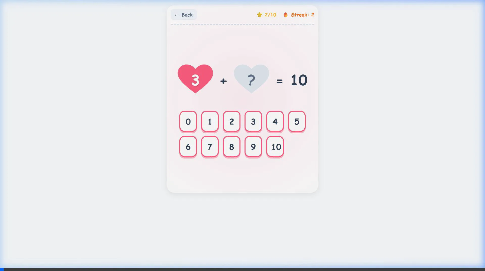
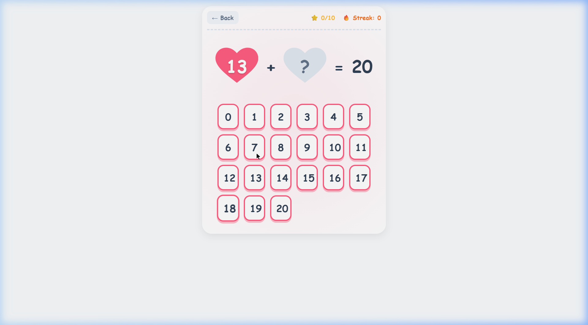
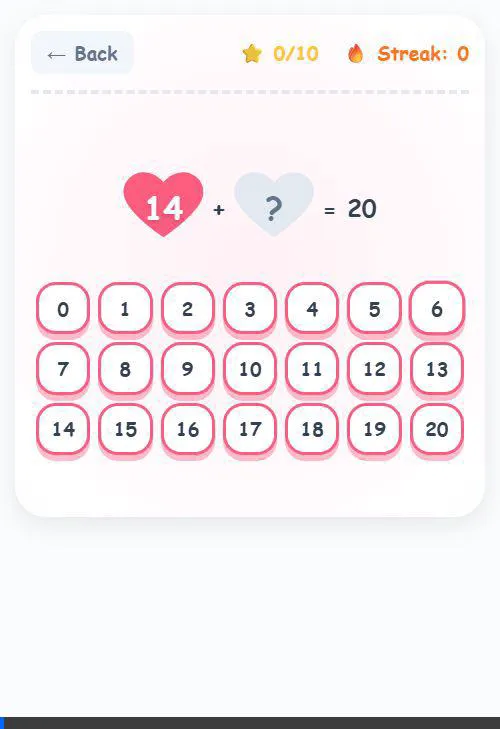

# Math Learning App - LIVE ON VERCEL! 🚀🎉

Great news! We have successfully built the foundation of the Math Learning App for your daughter. 

## What We Accomplished

1. **Project Setup**: We initialized a fresh Vite + React project.
2. **Design System**: We created a vibrant, kid-friendly styling system with custom CSS variables (Pink, Bright Blue, Sunny Yellow, and Green), bouncing micro-animations, and large, tactile buttons.
3. **Onboarding Screen**: We built a welcoming first screen that asks for her "Name" and "Age" to personalize the experience.
4. **Organized Exercise Selector**: Once the profile is set, the app shows game cards categorized by difficulty (🟢 Easy, 🟡 Medium, 🔴 Hard) and tagged with recommended Age ranges.
5. **Odd & Even Explorer Game**: We built the first fully interactive game module!
   - Shows a random number from 1 to 20.
   - Large "Odd" and "Even" buttons to guess.
   - Live score tracking (out of 10 stars) and streak counter (🔥).
   - Confetti bursts when she hits a streak of 5 or completes the game! 🎉
   - Visual shaking and color changes when she gets an answer wrong.
6. **Verliebte Zahlen (Numbers in Love)**: Added a second game tailored for number pairs summing to 10 *or* 20.
    - Features a custom Heart layout (SVG-shaped clip paths) linking two numbers.
    - Large 0-10 or 0-20 Number Pad for easy selection, utilizing a flexible auto-fit CSS grid.
    - Heartbeat scale animations for correct answers, and broken-heart logic for incorrect ones!
7. **Source Control**: Successfully connected the project to GitHub and pushed the initial version to the `seekho` repository.
8. **Mobile Responsiveness**: Implemented media queries to ensure a seamless experience on phones and tablets. Scaled down large UI elements, fixed card overlaps, and optimized the 21-button number pad for small screens.

## Validation Results

I ran a local session and used my browser agent to verify everything works flawlessly:

- The game logic correctly identifies Odd and Even numbers.
- The states flow seamlessly from Onboarding -> Selector -> Game.
- The animations (bouncing buttons, popping numbers, confetti) all render smoothly.

### Visual Walkthrough

Here are the application flows in action for both games!

````carousel

<!-- slide -->

<!-- slide -->

<!-- slide -->

<!-- slide -->

<!-- slide -->

<!-- slide -->

<!-- slide -->

<!-- slide -->

````

## Next Steps

We can deploy this so she can try it out today, or we can move right into building the next curriculum items like "Addition Adventure"! Let me know what you think.
